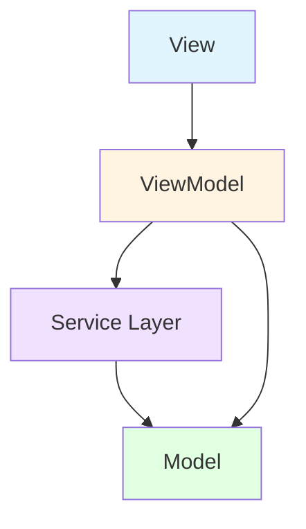

# Architecture

OpenCodeAppのアーキテクチャと設計について説明します。

## 概要

OpenCodeAppはMVVM（Model-View-ViewModel）パターンを採用したmacOSメニューバーアプリケーションです。



## レイヤー構成

### View Layer

**責任**: ユーザーインターフェースの表示とユーザー入力の処理

- `ContentView.swift`: メインビュー（SwiftUI）
  - メッセージ表示
  - 入力フォーム
  - セッションステータス表示
  - ボタン操作

**特性**:
- SwiftUIで実装
- `@ObservedObject`でViewModelの変化を監視
- UIのレンダリングとユーザーインタラクションのみを担当

### ViewModel Layer

**責任**: ビジネスロジックと状態管理

- `OpenCodeViewModel.swift`: メインビューモデル
  - セッション管理
  - メッセージ送信
  - スクリーンショット送信
  - エラーハンドリング

**特性**:
- `@MainActor`で実装
- `@Published`プロパティで状態管理
- 非同期処理を担当
- ViewとModelの仲介役

### Service Layer

**責任**: 外部API連携とデータ処理

- `OpenCodeAPIClient.swift`: OpenCode API通信
  - セッション作成
  - メッセージ送信
  - エラーハンドリング

- `ScreenshotCapture.swift`: スクリーンショット取得
  - 画面キャプチャ
  - 画像処理

- `ConfigManager.swift`: 設定管理
  - 設定ファイルの読み書き
  - バリデーション

**特性**:
- 複数のServiceが存在
- 各Serviceは単一の責任を持つ
- ViewModelから呼び出される

### Model Layer

**責任**: データ構造の定義

- `Config.swift`: 設定データ構造
  - APIキー
  - APIエンドポイント
  - セッションタイムアウト

- `OpenCodeMessage.swift`: メッセージデータ構造
  - メッセージID
  - セッションID
  - コンテンツ
  - ロール（user/assistant）
  - タイムスタンプ

- `OpenCodeSession.swift`: セッションデータ構造
  - セッションID
  - 作成日時
  - 更新日時
  - アクティブ状態

**特性**:
- `Codable`プロトコルに準拠
- データ検証ロジックを含む

### App Layer

**責任**: アプリケーションのライフサイクル管理

- `AppDelegate.swift`: アプリデリゲート
  - アプリの初期化
  - コンポーネントのセットアップ
  - アプリの終了処理

- `MenuBarManager.swift`: メニューバー管理
  - ステータスアイコンの表示
  - ポップアップの管理
  - 右クリックコンテキストメニューの表示
  - イベントハンドリング

**特性**:
- NSApplicationDelegateに準拠
- アプリ全体の初期化を担当
- メニューバーアプリとしての動作を制御

### Window Layer

**責任**: ウィンドウの管理と表示制御

- `FloatingChatWindow.swift`: フローティングチャットウィンドウ
  - 独立したチャットインターフェースの提供
  - リサイズ可能なウィンドウ管理
  - フローティングレベルでの表示制御

- `InputLauncherWindow.swift`: 入力ランチャーウィンドウ
  - 簡易入力インターフェースの提供
  - 画面中央配置
  - 送信後の自動クローズ制御

- `WindowStateManager.swift`: ウィンドウ状態管理
  - フローティングチャットウィンドウの表示/非表示管理
  - 入力ランチャーの表示/非表示管理
  - ウィンドウ間の排他制御

**特性**:
- NSWindowを継承したカスタムウィンドウ
- SwiftUIのHostingViewを使用
- ウィンドウレベル（.floating）での表示
- スペース間の移動対応（.canJoinAllSpaces）

### Service Layer (追加)

- `GlobalShortcutMonitor.swift`: グローバルショートカット監視
  - Cmd+Shift+O: チャットウィンドウ切り替え
  - Cmd+Shift+I: 入力ランチャー表示
  - Shift+マウスドラッグ: 矩形選択開始
  - ESC: 選択キャンセル
  - アクセシビリティ権限の管理

## データフロー

### セッション作成フロー

```
ユーザーアクション (「セッション作成」ボタンクリック)
  ↓
ContentView (ボタンタップ)
  ↓
OpenCodeViewModel.createSession()
  ↓
OpenCodeAPIClient.createSession()
  ↓
OpenCodeAPIへのリクエスト
  ↓
OpenCodeAPIからのレスポンス
  ↓
OpenCodeSessionインスタンス生成
  ↓
ViewModelのcurrentSessionを更新 (@Published)
  ↓
ContentViewのUIが自動更新 (@ObservedObject)
```

### メッセージ送信フロー

```
ユーザーアクション (メッセージ入力 + Enter)
  ↓
ContentView (TextFieldのonSubmit)
  ↓
OpenCodeViewModel.sendMessage()
  ↓
OpenCodeAPIClient.sendMessage()
  ↓
OpenCodeAPIへのリクエスト (メッセージ)
  ↓
OpenCodeAPIからのレスポンス
  ↓
OpenCodeMessageインスタンス生成 (user + assistant)
  ↓
ViewModelのmessagesに追加 (@Published)
  ↓
ContentViewのUIが自動更新 (ScrollView)
```

### スクリーンショット送信フロー

```
ユーザーアクション (カメラアイコンクリック)
  ↓
ContentView (ボタンタップ)
  ↓
OpenCodeViewModel.captureAndSendScreenshot()
  ↓
ScreenshotCapture.captureScreenAsData()
  ↓
画像データ生成 (PNG形式)
  ↓
Base64エンコード
  ↓
メッセージ作成
  ↓
OpenCodeAPIClient.sendMessage()
  ↓
OpenCodeAPIへのリクエスト (メッセージ)
  ↓
OpenCodeAPIからのレスポンス
  ↓
ViewModelのmessagesに追加 (@Published)
   ↓
ContentViewのUIが自動更新
```

### チャットウィンドウ表示フロー

```
ユーザーアクション (Cmd+Shift+O または 右クリックメニュー)
  ↓
GlobalShortcutMonitor.didToggleChatWindow() または MenuBarManager.showChatWindow()
  ↓
WindowStateManager.toggleChatWindow()
  ↓
チャットウィンドウの表示/非表示切り替え
  ↓
isChatWindowVisibleの更新 (@Published)
```

### 入力ランチャー表示フロー

```
ユーザーアクション (Cmd+Shift+I または 右クリックメニュー)
  ↓
GlobalShortcutMonitor.didShowInputLauncher() または MenuBarManager.showInputLauncher()
  ↓
WindowStateManager.showInputLauncher()
  ↓
チャットウィンドウが表示中の場合は非表示
  ↓
入力ランチャーを表示
  ↓
画面中央に配置
```

## メモリ管理

### ARC (Automatic Reference Counting)

SwiftのARCによってメモリ管理が自動化されていますが、以下の点に注意が必要です。

### 強参照循環の回避

#### ViewModelでのCombineの管理

`OpenCodeViewModel`では、`Combine`のサブスクリプションを適切に管理します：

```swift
@MainActor
class OpenCodeViewModel: ObservableObject {
    private var cancellables = Set<AnyCancellable>()
    
    init(apiClient: OpenCodeAPIClient, screenshotCapture: ScreenshotCapture) {
        self.apiClient = apiClient
        self.screenshotCapture = screenshotCapture
    }
    
    // cancellablesはdeinit時に自動的にキャンセルされる
}
```

#### Closureでのキャプチャ

非同期処理で`self`をキャプチャする際は、`weak`参照を使用します：

```swift
Task {
    await apiClient.createSession()
    // ViewModel自体は@MainActorで管理されるため、強参照は問題ない
    // ただし、将来的にコールバックを使用する場合はweak selfを考慮
}
```

### リソース管理

#### 画像データの管理

スクリーンショットの画像データは、処理完了後に適切に解放されます：

```swift
func captureScreenAsData() throws -> Data {
    let image = try captureScreen()
    let imageData = try convertToPNG(image)
    return imageData // DataはARCで管理され、不要になると解放される
}
```

#### ネットワークリソース

`URLSession`の使用は、リクエスト完了後に自動的にクリーンアップされます：

```swift
let (data, response) = try await session.data(for: request)
// データとレスポンスはスコープ外で自動的に解放される
```

## 非同期処理

### async/awaitの使用

Swift 5.5+のasync/awaitを全面的に採用しています：

```swift
func createSession() async throws -> OpenCodeSession {
    let (data, response) = try await session.data(for: request)
    return try JSONDecoder().decode(OpenCodeSession.self, from: data)
}
```

### MainActorの使用

UI操作は`@MainActor`で実行されます：

```swift
@MainActor
class OpenCodeViewModel: ObservableObject {
    @Published var currentSession: OpenCodeSession?
    
    func createSession() async {
        isLoading = true
        do {
            let session = try await apiClient.createSession()
            currentSession = session // UI更新はMainActorで行われる
        } catch {
            errorMessage = error.localizedDescription
        }
        isLoading = false
    }
}
```

### エラーハンドリング

非同期処理でのエラーハンドリング：

```swift
do {
    let session = try await apiClient.createSession()
    currentSession = session
} catch APIError.unauthorized {
    errorMessage = "認証に失敗しました"
} catch {
    errorMessage = "予期しないエラー: \(error.localizedDescription)"
}
```

## セキュリティ

### APIキーの管理

- APIキーは`.config.json`に保存
- `.config.json`は`.gitignore`に含まれる
- リポジトリにはコミットされない

### ネットワーク通信

- HTTPSを使用（`https://api.opencode.ai`）
- 認証にはBearer Tokenを使用
- タイムアウト設定（30秒）

### 権限管理

- スクリーンショット取得には権限は不要（システムAPI使用）
- 将来的にはScreenCaptureKitへの移行が必要

## 将来の改善点

1. **ScreenCaptureKitへの移行**: CGWindowListCreateImageは非推奨
2. **ユニットテストの追加**: 各コンポーネントのテストカバレッジ向上
3. **ロギングの追加**: デバッグとトラブルシューティングの強化
4. **エラーリカバリー**: ネットワークエラー時のリトライロジック
5. **パフォーマンス最適化**: 大量メッセージ時のパフォーマンス改善
